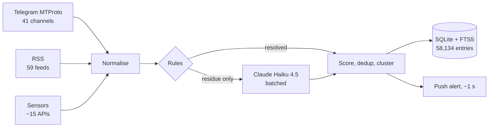

# Karol Polikarp Wilczyński

Lawyer (University of Warsaw) at Poland's **Ministry of Digital Affairs**, working on AI Act regulatory sandboxes. Outside that I build and run production systems: real-time OSINT aggregation, legal search over ~15,000 Polish statutes, on-device PII anonymisation — most of it self-hosted on a Raspberry Pi.

## Zorza — real-time OSINT aggregation

Telegram (MTProto), RSS, X and satellite/market sensors in one multi-column dashboard. Every item is scored for credibility; a push alert lands in about a second.

**Stack** — TypeScript end to end. Node 20 + Fastify 5 + better-sqlite3 + gramjs on the server; React 18 + Vite + Tailwind on the client. Claude Haiku 4.5 for classification, clustering and Q&A; Claude Sonnet 5 for briefs; local `Xenova/all-MiniLM-L6-v2` embeddings (~22 MB, runs offline). Self-hosted on a Raspberry Pi 5 behind a Cloudflare Tunnel, in a hardened systemd sandbox.

- **Code** — 25,210 LOC across 176 files · 242 passing tests · 32 API routes · CI runs typecheck + tests
- **Sources** — 100 content channels (41 Telegram, 59 RSS) plus ~15 sensor APIs: NASA FIRMS, AIS, ADS-B, GDELT, CFTC COT, Polymarket
- **Archive** — 58,134 entries, 30-day retention, SQLite with FTS5 across 7 tables
- **Latency** — about a second from ingest to push alert
- **Cost** — **$2.06/day**, all in. A Bloomberg Terminal is $31,980/yr.
- **Pace** — 174 commits in 13 days

> Rules decide first. The LLM only runs on what the rules didn't resolve.

### Decisions that moved a number

| Problem | Change | Result |
|---|---|---|
| The dedup threshold was a guess | Measured Jaccard on labelled pairs: literal repost `0.83`, paraphrase `0.39`, unrelated `0.00` | Cut at `0.70` — derived from the distribution, not tuned by feel |
| Telegram `FLOOD_WAIT` locked the account for 8 h | Cache `(channel_id, access_hash)` instead of re-resolving usernames on every restart | Zero resolve calls on startup; the lockout has not recurred |
| LLM calls dominated the bill | Batching gate — classify in groups, and only on items the rules abstained on | 51 → **4** calls/h · $2.00 → **$0.78**/day |
| "Big move" alerts fired on quiet instruments | Express the threshold in volatility sigmas, not percent | Alerts scale to each instrument's own noise floor |
| Weekend traffic didn't justify weekend spend | Reduced-cadence weekend mode, one review pass on Sunday | $4.30 → **$0.30** per weekend |

<table>
<tr>
<td></td>
<td></td>
</tr>
<tr>
<td align="center">Credibility scoring, per item</td>
<td align="center">Ask the archive — answers cite their sources</td>
</tr>
</table>

Ingest pipeline

*The repo is private; the landing page is public. The numbers above come from `cloc`, the test runner and the production database. Happy to walk through the code.*

## Open source

| Repo | ⭐ | What | Lang | Licence |
|---|---|---|---|---|
| **[parawan](https://github.com/karolpolikarp/parawan)** · [live](https://parawan.karolwilczynski.com) |  | Polish PII anonymiser — PESEL, NIP, REGON, IBAN, personal names. One self-contained HTML file, 100% offline, zero dependencies. ~4k LOC | TypeScript | Apache-2.0 |
| **[anonimizator-ai](https://github.com/karolpolikarp/anonimizator-ai)** | | Optional on-device NER layer for Parawan. ONNX in the browser lifts recall on rare surnames **21% → 79–90%** while precision holds at **99.6%**. WIP, ~3.2k LOC | TypeScript | Apache-2.0 |
| **[ISAP-scraper](https://github.com/karolpolikarp/ISAP-scraper)** |  | Client for the Polish Parliament ELI API — fetch, monitor and pull full text of Dziennik Ustaw and Monitor Polski. 6 CLI modes, ~1.5k LOC | Python | MIT |
| **[claude-usage-streamdeck](https://github.com/karolpolikarp/claude-usage-streamdeck)** · [page](https://karolwilczynski.com/claude-usage-streamdeck/) | | Stream Deck plugin showing live Claude usage: 5 h session, week, Fable limit, credits, today's token cost. Node 20, **1** dependency, no telemetry. ~1.4k LOC | JavaScript | MIT |
| **[Stefka-PPLuM-macOS.Silicon](https://github.com/karolpolikarp/Stefka-PPLuM-macOS.Silicon)** | | Offline meeting transcription and summarisation on Apple Silicon: mlx-whisper + PLLuM-12B (~13 GB). Nothing leaves the machine. ~3k LOC | Python | MIT |
| **[Multi-Sequence-Clicker](https://github.com/karolpolikarp/Multi-Sequence-Clicker)** | | Auto-clicker with Bézier-curve humanised cursor motion. No dependencies beyond the JDK. ~1.1k LOC | Java | MIT |
| **[karolpolikarp.github.io](https://github.com/karolpolikarp/karolpolikarp.github.io)** · [live](https://karolwilczynski.com) | | karolwilczynski.com — vanilla HTML/CSS/JS, no build step | HTML | — |

## Products in production

Running services with users. The repos are private; the links go to the live builds.

<table>
<tr>
<td></td>
<td></td>
</tr>
<tr>
<td></td>
<td></td>
</tr>
</table>

| Product | What it does | Stack | Scale |
|---|---|---|---|
| **[JakiePrawo.pl](https://jakieprawo.pl)** `BETA` | Plain-language search across ~15,000 Polish statutes | React · Supabase (Postgres + pgvector) · Deno Edge Functions · Claude API · an MCP server (8 tools) on a Raspberry Pi | ~55k LOC + ~8k tests · a 7-layer anti-hallucination pipeline validates every citation before it is shown |
| **[UpFor.pl](https://upfor.pl)** `BETA` | Availability calendar for gaming groups | Next.js 15 · React 19 · tRPC v11 · Turborepo · Postgres `LISTEN/NOTIFY` → SSE · Claude Haiku 4.5 with tool-use | ~113k LOC + ~17k tests · 20 routers / ~125 procedures · 27 data models · Discord bot with 18 slash commands |
| **[Majeranek](https://majeranek.vercel.app)** `ALPHA` | Cross-media recommendations built from drag-and-drop tier lists | Next.js 14 · Supabase (53 models, RLS) | ~110k LOC · ELO / Glicko-2 duel ranking · 2,256 i18n keys |
| **[AutoMargiela](https://replica.karolwilczynski.com)** | Price monitor for Maison Margiela Replica across Notino, Sephora and Flaconi | Python · Playwright on a 6-hour systemd timer · Flask + SQLite | ~14k LOC · 12 charts · z-score and percentile buy signals · Discord/Telegram alerts |
| **AIgets.me** `WIP` | One portable personality profile, exported as a system prompt for Claude, GPT or Gemini | React 19 · Vite · Claude Haiku | ~33k LOC |

## Data science notebooks

| Repo | Question | Data | Method |
|---|---|---|---|
| [ds-SGH-Prognozy-gieldowe-z-ESPI](https://github.com/karolpolikarp/ds-SGH-Prognozy-gieldowe-z-ESPI) | Can GPT-4o-mini predict Allegro's share price from regulatory filings? | 134 ESPI filings over 1,050 sessions | LLM extraction → signal → backtest |
| [ds-VideoGameSales](https://github.com/karolpolikarp/ds-VideoGameSales) | What drives global game sales? | ~16,500 titles | K-Means + RandomForest |
| [ds-Winnipeg](https://github.com/karolpolikarp/ds-Winnipeg) | Airbnb price structure in Winnipeg, in R | 1,626 listings | MICE imputation, k-means, leaflet maps |
| [ds-WashingtonDC](https://github.com/karolpolikarp/ds-WashingtonDC) | Which listing attributes actually move price? | 5,454 listings | chi-square + OLS |
| [ds-speed-dating](https://github.com/karolpolikarp/ds-speed-dating) | Can participants be segmented usefully? | 8,378 records, ~200 variables reduced to 10 | PCA + K-Means |

## Background

**Ministry of Digital Affairs of Poland** — AI Act regulatory sandboxes. Lawyer, University of Warsaw.

**Postgraduate** — Big Data (PJATK) · AI in Business and the Public Sector (SGH) · Python for AI (PJATK) · IT Systems and Databases (PJATK)

**Certificates** — NVIDIA Deep Learning · AI_devs 4 Builders · AI_devs 3 Agents · AI Devs 2 · Java Developer Plus · ITIL 4 Foundation

<b>Wersja polska</b>

## Karol Polikarp Wilczyński

Prawnik (Uniwersytet Warszawski) w **Ministerstwie Cyfryzacji**, zajmuję się piaskownicami regulacyjnymi AI Act. Poza tym buduję i utrzymuję systemy produkcyjne: agregację OSINT w czasie rzeczywistym, wyszukiwarkę po ~15 000 polskich aktów prawnych i anonimizację danych osobowych działającą lokalnie — w większości self-hosted na Raspberry Pi.

[karolwilczynski.com](https://karolwilczynski.com) · [LinkedIn](https://linkedin.com/in/karolpwilczynski) · [karolpwilczynski@gmail.com](mailto:karolpwilczynski@gmail.com)

### Zorza — agregacja OSINT w czasie rzeczywistym

Telegram (MTProto), RSS, X i sensory satelitarno-rynkowe w jednym wielokolumnowym pulpicie. Każdy wpis punktowany pod kątem wiarygodności, alert push w około sekundę. **[zorza.karolwilczynski.com](https://zorza.karolwilczynski.com)** — repozytorium prywatne, landing publiczny.

TypeScript od końca do końca: Node 20 + Fastify 5 + better-sqlite3 + gramjs po stronie serwera, React 18 + Vite + Tailwind po stronie klienta. Claude Haiku 4.5 (klasyfikacja, klastrowanie, Q&A) i Claude Sonnet 5 (briefy), lokalne embeddingi `Xenova/all-MiniLM-L6-v2` (~22 MB, offline). Raspberry Pi 5 za tunelem Cloudflare, utwardzona piaskownica systemd.

> Najpierw decydują reguły. LLM uruchamia się wyłącznie tam, gdzie reguły nie rozstrzygnęły.

- 25 210 linii kodu w 176 plikach · 242 przechodzące testy · 32 endpointy API · CI: typecheck i testy
- 100 kanałów treści (41 Telegram, 59 RSS) i ~15 API sensorycznych: NASA FIRMS, AIS, ADS-B, GDELT, CFTC COT, Polymarket
- 58 134 zarchiwizowane wpisy, retencja 30 dni, SQLite z FTS5 na 7 tabelach
- Koszt utrzymania **2,06 USD na dobę**. Terminal Bloomberga kosztuje 31 980 USD rocznie.
- 174 commity w 13 dni

| Problem | Zmiana | Efekt |
|---|---|---|
| Próg deduplikacji był zgadywany | Pomiar Jaccarda na oznaczonych parach: dosłowny przedruk `0,83`, parafraza `0,39`, teksty niepowiązane `0,00` | Cięcie na `0,70` — wyprowadzone z rozkładu, nie z wyczucia |
| `FLOOD_WAIT` Telegrama blokował konto na 8 h | Cache `(channel_id, access_hash)` zamiast rozwiązywania nazw przy każdym restarcie | Zero wywołań resolve po starcie, blokada się nie powtórzyła |
| Koszt LLM dominował rachunek | Bramka batchowania — klasyfikacja grupami i tylko tam, gdzie reguły się wstrzymały | 51 → **4** wywołania/h · 2,00 → **0,78** USD/dobę |
| Alerty o dużym ruchu odpalały na spokojnych instrumentach | Próg w sigmach zmienności zamiast w procentach | Alerty skalują się do własnego poziomu szumu instrumentu |
| Weekendowy ruch nie uzasadniał weekendowych kosztów | Tryb weekendowy o obniżonej kadencji, jeden przegląd w niedzielę | 4,30 → **0,30** USD za weekend |

### Otwarty kod

- **[parawan](https://github.com/karolpolikarp/parawan)** ⭐5 — lokalny anonimizator polskich danych osobowych (PESEL, NIP, REGON, IBAN, nazwiska). Jeden samodzielny plik HTML, 100% offline, zero zależności. TypeScript, Apache-2.0, ~4 tys. linii. [parawan.karolwilczynski.com](https://parawan.karolwilczynski.com)
- **[anonimizator-ai](https://github.com/karolpolikarp/anonimizator-ai)** — opcjonalna warstwa AI (NER) do Parawana, ONNX na urządzeniu. Czułość na rzadkich nazwiskach **21% → 79–90%**, precyzja utrzymana na **99,6%**. TypeScript, Apache-2.0, WIP, ~3,2 tys. linii
- **[ISAP-scraper](https://github.com/karolpolikarp/ISAP-scraper)** ⭐1 — klient API ELI Sejmu: pobieranie, monitorowanie i pełne teksty Dziennika Ustaw oraz Monitora Polskiego. 6 trybów CLI, Python, MIT, ~1,5 tys. linii
- **[claude-usage-streamdeck](https://github.com/karolpolikarp/claude-usage-streamdeck)** — wtyczka Stream Deck z bieżącym zużyciem Claude: sesja 5 h, tydzień, limit Fable, kredyty, dzisiejszy koszt tokenów. Node 20, **1** zależność, bez telemetrii. MIT, ~1,4 tys. linii
- **[Stefka-PPLuM-macOS.Silicon](https://github.com/karolpolikarp/Stefka-PPLuM-macOS.Silicon)** — offline'owa transkrypcja i streszczanie spotkań na Apple Silicon: mlx-whisper + PLLuM-12B (~13 GB). Nic nie opuszcza komputera. Python, MIT, ~3 tys. linii
- **[Multi-Sequence-Clicker](https://github.com/karolpolikarp/Multi-Sequence-Clicker)** — autoklikacz z humanizowanym ruchem kursora po krzywych Béziera. Zero zależności poza JDK. Java, MIT, ~1,1 tys. linii
- **[karolpolikarp.github.io](https://github.com/karolpolikarp/karolpolikarp.github.io)** — [karolwilczynski.com](https://karolwilczynski.com), czysty HTML/CSS/JS, bez kroku budowania

### Produkty w produkcji

Działające serwisy z użytkownikami. Repozytoria prywatne, linki prowadzą do wersji live.

| Produkt | Co robi | Stack | Skala |
|---|---|---|---|
| **[JakiePrawo.pl](https://jakieprawo.pl)** `BETA` | Wyszukiwanie zwykłym językiem po ~15 000 polskich aktów prawnych | React · Supabase (Postgres + pgvector) · Deno Edge Functions · Claude API · serwer MCP (8 narzędzi) na Raspberry Pi | ~55 tys. linii + ~8 tys. testów · 7-warstwowy pipeline antyhalucynacyjny waliduje każdy przywołany przepis |
| **[UpFor.pl](https://upfor.pl)** `BETA` | Kalendarz dostępności dla ekip growych | Next.js 15 · React 19 · tRPC v11 · Turborepo · Postgres `LISTEN/NOTIFY` → SSE · Claude Haiku 4.5 z tool-use | ~113 tys. linii + ~17 tys. testów · 20 routerów / ~125 procedur · 27 modeli · bot Discord z 18 komendami |
| **[Majeranek](https://majeranek.vercel.app)** `ALPHA` | Rekomendacje międzymedialne z tier list przeciąganych myszą | Next.js 14 · Supabase (53 modele, RLS) | ~110 tys. linii · ranking pojedynkowy ELO / Glicko-2 · 2 256 kluczy i18n |
| **[AutoMargiela](https://replica.karolwilczynski.com)** | Monitor cen Maison Margiela Replica w Notino, Sephorze i Flaconi | Python · Playwright na timerze systemd co 6 h · Flask + SQLite | ~14 tys. linii · 12 wykresów · sygnały zakupu z z-score i percentyli · alerty Discord/Telegram |
| **AIgets.me** `WIP` | Jeden przenośny profil osobowości eksportowany jako system prompt do Claude, GPT lub Gemini | React 19 · Vite · Claude Haiku | ~33 tys. linii |

### Notatniki data science

[ds-SGH-Prognozy-gieldowe-z-ESPI](https://github.com/karolpolikarp/ds-SGH-Prognozy-gieldowe-z-ESPI) (czy GPT-4o-mini przewidzi kurs Allegro ze 134 raportów ESPI na 1 050 sesji?) · [ds-VideoGameSales](https://github.com/karolpolikarp/ds-VideoGameSales) (~16,5 tys. tytułów, K-Means i RandomForest) · [ds-Winnipeg](https://github.com/karolpolikarp/ds-Winnipeg) (1 626 ofert Airbnb w R: MICE, k-means, leaflet) · [ds-WashingtonDC](https://github.com/karolpolikarp/ds-WashingtonDC) (5 454 oferty, chi-kwadrat i MNK) · [ds-speed-dating](https://github.com/karolpolikarp/ds-speed-dating) (8 378 rekordów, ~200 zmiennych do 10 cech, PCA i K-Means)

### Zaplecze

**Ministerstwo Cyfryzacji** — piaskownice regulacyjne AI Act. Prawnik, Uniwersytet Warszawski.

**Studia podyplomowe** — Big Data (PJATK) · Sztuczna inteligencja w biznesie i sektorze publicznym (SGH) · Python w AI (PJATK) · Systemy informatyczne i bazy danych (PJATK)

**Certyfikaty** — NVIDIA Deep Learning · AI_devs 4 Builders · AI_devs 3 Agents · AI Devs 2 · Java Developer Plus · ITIL 4 Foundation

